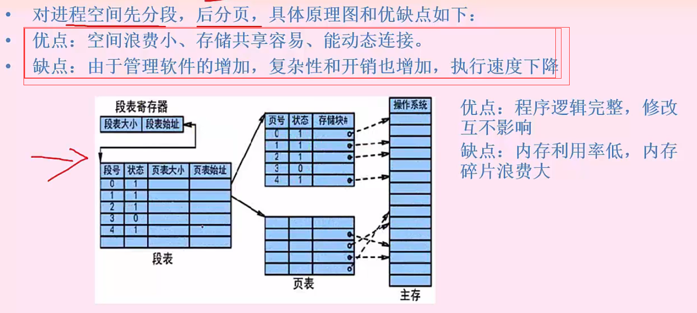
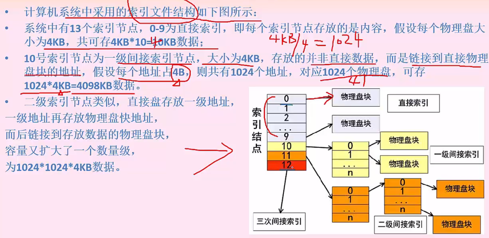
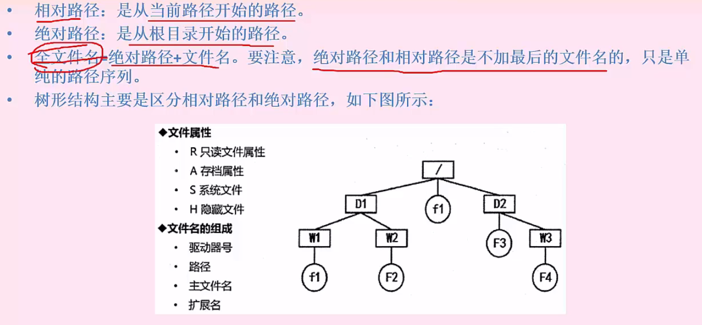

# 第4章 计算机操作系统知识

## 一. 操作系统知识基础
  - 特征：并发性、共享性、虚拟性、不确定性
  - 功能：进程管理、存储管理、文件管理、作业管理
  - 分类：批处理操作系统、分时操作系统、实施操作系统、网络操作体统、分布式操作系统、微机操作系统、嵌入式操作系统
  > 嵌入式操作系统初始化过程按照自底向上、从硬件到软件次序：芯片级初始化（微处理的初始化）->板级初始化（板卡和其它硬件设备初始化）->系统初始化（软件及操作系统）

## 二.  进程管理

## 三.  存储管理
  - 主要是 主存 和 外存之间的管理（就是内存和硬盘之间的数据置换）
  - 地址重定位：将逻辑地址转为实际物理地址的过程，分为静态重定位（程序运行前已经装入主存）、动态重定位（边运行边转换）

### 1.  分区存储
- 静态分区，动态分区，重定位分区
- 将某进程运行需要的内存整体一起分配给它
- 缺点：进程需要的内存比较大时无法满足，进程无法运行

### 2.  页式存储
- 页式存储是： 逻辑页号 对应 物理块号（页帧号）
- 页号：对应物理块号，位数表示了有多少页（16-31；16位 2的16方个页面）
- 页内地址：物理偏移地址，位数表示了每个页的大小（0-15；16位 2的16方=64KB）每个页的大小是固定一样的

- 快表：是一种很快的页面
  - 是一种小容量的相联存储器，有快速存储器组成，按内容访问，速度快，快且可以从硬件上保证内容并行查找，一般用来存放当前访问最频繁的少数活动页面的页号
  - 快表是将页面存储于cache中；慢表将页面存储于内存上
  - 快表是访问一次cache和一次内存，因此更快（chche取页号组成物理地址，内存取页内地址数据）；慢表需要访问两次内存才能取出页（内存取页号组成物理地址，内存取页内地址数据）

### 3.  段式存储
- 页式存储是： 逻辑页号 对应 物理块号（页帧号）
- 段号：对应物理块号，位数表示了有多少页（16-31；16位 2的16方个页面）
- 段内地址：表示这个段的大小，位数表示了每个段的大小（0-15；16位 2的16方=64KB）每个段的大小是不一样的
- 真实内存地址是：段号 =》 (基址：段内开始的地址)40K + 30K(段长：表示这个段的大小（段长<段内地址）)

### 4.  段页式存储

## 四.  设备管理
### 1. 设备分类
- 数据组织分类：块设备、字符设备
- 资源分配角度分类：独占设备、共享设备、虚拟设备
- 数据传输速率分类：地蹙设备、中速设备、告诉设备

### 2. I/O 软件层次结构

### 3. 输入输出技术
- 程序控制方式（查询）：CPU主动查询外设是否完成数据传输，效率极低
- 程序终端方式：外设完成数据传输后，向CPU发送终端，等待CPU传输数据，效率先对较高，适用于键盘等实时性较高的场景
- DMA方式（直接主存存取）：CPU只完成必要的初始化等操作吗，数据传输整个过程都有DMA控制器来完成，在主存与外设之间建立直接的数据通路，效率高。适用于硬盘等高速设备。

### 4. 虚设备和Spooling技术

## 五.  文件管理

### 1.  文件索引
- 每个物理块大小为 1kb，每个物理块地址为 4B
- 直接索引：存放物理块数据 1kb
- 一级间接索引：存放物理块地址，每个物理块可以存放 1kb / 4B = 1024 / 4 = 256 个物理块地址，每个物理块 1kb， 就是一共 256 * 1 kb
- 二级间接索引：存放一级索引地址，每个物理块可以存储 256 个一级地址索引，每个一级地址可以存储256个物理块地址，就是 256 * 256 个物理块，每个物理块 1kb，大小是 256 * 256 * 1 kb

### 2.  文件目录树形结构

